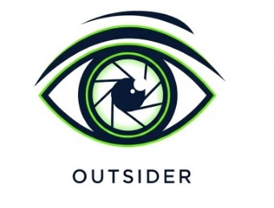

<div align="center">
  
   

# Outsider 

Video Intrusion Detection System


</div>

Computer vision pipeline for intrusion detection in restricted zones using YOLOv8 + OpenCV.

## Features

- Person detection with YOLOv8 (pre-trained on COCO)
- Real-time visualization with bounding boxes and ROIs
- Google Colab compatible

## Structure

```
outsider/
├── src/
│   ├── detector.py          # Person detection with YOLOv8
│   ├── zone_manager.py      # Restricted zone (ROI) management
│   ├── alert_manager.py     # Alert system
│   ├── video_pipeline.py    # Main video pipeline
│   └── utils.py             # General utilities
├── configs/
│   └── zones.json           # Zone configuration
├── tests/
│   └── test_zones.py        # Unit tests
├── outsider_colab.ipynb     # Google Colab notebook
└── requirements.txt
```

## Quick start

```bash
uv pip install -r requirements.txt

# Local video
python -m src.video_pipeline --source video.mp4 --zones configs/zones.json

# RTSP stream
python -m src.video_pipeline --source rtsp://ip:port/stream --zones configs/zones.json

# Webcam
python -m src.video_pipeline --source 0 --zones configs/zones.json
```

## Public datasets

- [VIRAT Video Dataset](https://viratdata.org/)
- [COCO Dataset](https://cocodataset.org/)
- [Town Centre Dataset (Oxford)](https://megapixels.cc/oxford_town_centre/)

